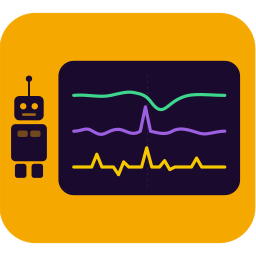

<table>
<tr>
<td width="180" valign="top" align="center">
  <!-- The leading <br> balances the h1's top margin, so the icon sits midway between the cell's top edge and the title. -->
  <p align="center"><br></p>
  <h1 align="center">WPILog Analyzer</h1>
</td>
<td valign="middle">

AI-powered FRC robot log analysis for VS Code. It analyzes `.wpilog` telemetry files from the roboRIO to help diagnose brownouts, CAN errors, swerve drive issues, loop timing problems, and more.

The extension runs an [MCP server](https://modelcontextprotocol.io/) whose tools let an AI agent analyze robot logs and extract their raw data for further processing. The server is designed for and tested with Claude. Copilot and other agents that use VS Code's MCP server registry find it there. Claude Code reads `.mcp.json` instead, so the extension adds the server to your robot project's `.mcp.json` (see [Using It with Claude Code](#using-it-with-claude-code)).

</td>
</tr>
</table>

## Quick Start

1. Install the extension (see [Install](#install)).
2. Put your `.wpilog` files in `~/riologs`, or set another folder in [Settings](#settings).
3. Open your robot project in VS Code. With Claude Code, approve the `wpilog-analyzer` server the first time it asks in that project. If Claude Code was already running, restart it first: it reads its servers only when it starts (see [Using It with Claude Code](#using-it-with-claude-code)).
4. Ask your AI assistant about your logs:
   - *"What logs are available?"*
   - *"Can you walk me through the power delivery in our last match?"*
   - *"Help me understand if we had any CAN bus issues while enabled"*
   - *"How did our swerve modules perform?"*

How deep the analysis goes depends on the AI model you use. The server provides the tools and the data; the model does the reasoning.

## Install

The extension is not on the Visual Studio Marketplace. Download `wpilog-analyzer-{version}.vsix` from the [releases page](https://github.com/TripleHelixProgramming/wpilog-mcp/releases) (a pre-release is a test build of the next version), then:

1. Open the Extensions sidebar (`Ctrl+Shift+X`, or `Cmd+Shift+X` on macOS), click `...` at its top right, choose **Install from VSIX...**, and select the downloaded file.
2. Restart VS Code.

Or from the command line:
```bash
code --install-extension wpilog-analyzer-{version}.vsix
```

If you use the WPILib VS Code distribution, install with its own `code` binary or its Extensions sidebar. The system VS Code and WPILib VS Code keep separate extension directories.

## How It Works

The extension starts once VS Code has finished starting up, and registers the server with VS Code through its MCP server provider API. When VS Code asks for the server, the extension finds Java, the server JAR, and your log directories (see [Auto-Detection](#auto-detection)), and gives VS Code a stdio server to run. Changing a `wpilog-mcp` setting or the TBA key restarts the server with the new values.

Keep your robot project open in VS Code while you analyze logs. The agent can then read your code too: it can match logged entry names to the subsystems that write them, compare PID constants with the behavior in the log, and fit its analysis to your robot. The server tells it to: an entry's name does not say for certain what it measures, and the code that logs it does.

## Using It with Claude Code

Claude Code doesn't use VS Code's MCP server registry; it finds servers in a `.mcp.json` file in the folder it runs in. So in a WPILib robot project (a folder with `.wpilib/wpilib_preferences.json`), the extension adds a `wpilog-analyzer` entry to that folder's `.mcp.json`. It leaves other servers in the file alone, and doesn't touch a file that isn't valid JSON. One checkbox controls this: **Enable For Claude Code** (`wpilog-mcp.enableForClaudeCode`, on by default). It affects only Claude Code, since Copilot and other VS Code agents get the server from VS Code itself.

There is nothing to set up. Open the robot project in VS Code with the extension installed, start Claude Code there, and approve `wpilog-analyzer` when it asks. Claude Code asks once per project before starting a server from `.mcp.json`, and `/mcp` lists it. This works for Claude Code in VS Code and for the `claude` command in a terminal in that folder.

Claude Code reads `.mcp.json` only when a session starts; a running session, a new conversation in it, and `/clear` don't pick up a new server. So when the extension adds the entry to a project, it tells you, once per project, that a Claude Code session already running there needs a restart. If the Claude Code extension for VS Code is installed, the notice offers **Reload Window**, which restarts its sessions. In a terminal, exit Claude Code and run `claude --continue`, which starts a new session with your conversation. **Don't Show Again** turns the notice off, for those who use only Copilot or other VS Code agents.

As with the [standalone install](../doc/STANDALONE.md), the entry only starts the server (Java, heap size, and JAR) with a configuration file, and the configuration lives in that file. The extension keeps one such file per project in its storage, in the format of the standalone install's `servers.yaml`. It holds the project's log directories, team number, and TBA key, so Claude Code in a project gets the same settings VS Code uses there (see [Settings](#settings)).

When you change a User setting (or the TBA key), the extension rewrites the configuration file of every project that has the entry, open or not. Changing a project's own setting rewrites only that project's file. Claude Code picks up the change the next time it starts the server: in a new session, or when you reconnect the server in `/mcp`. The entry itself changes only with the Java path or heap size, and is updated the next time the project is opened in VS Code. A project's own setting edited outside VS Code is also picked up then.

Keep `.mcp.json` out of git. Nothing in the entry is secret, but it holds this computer's Java, JAR, and configuration paths, which don't exist on a teammate's computer, and each teammate's extension would rewrite it with their own. So the extension doesn't write into a `.mcp.json` that git already tracks (it tells you how to stop tracking it), and when git would pick the file up, it offers once to add `.mcp.json` to `.gitignore`.

The TBA key needs nothing extra. The key you set with **WPILog Analyzer: Set The Blue Alliance API Key** reaches Claude Code's server through the configuration file, which only you can read. It is never in `.mcp.json`, which holds only that file's path, and you set no environment variable.

Updates don't break the entry. It points at a copy of the server JAR in the extension's storage, whose path doesn't change; after an update, the extension refreshes the copy the next time VS Code opens a project with the entry. An entry written by an earlier version (pointing at a folder VS Code deletes after an update) is rewritten when the project is next opened.

If you also use the standalone install with Claude Code, see [Using It Alongside the Standalone Install](#using-it-alongside-the-standalone-install).

In a folder that is not a robot project (a folder of logs, say), run **WPILog Analyzer: Add to Claude Code in This Folder** from the Command Palette. The command works even with **Enable For Claude Code** off; while the setting is on, the extension keeps the entry up to date. To stop, turn off **Enable For Claude Code** and delete the `wpilog-analyzer` entry from `.mcp.json`.

## Requirements

- Java 17 or later. The WPILib installer includes a suitable JDK, which the extension finds by itself.
- VS Code 1.101 or later, with an MCP-capable AI agent.

## Settings

Your **User** settings apply to every project. A project's own settings (**Workspace**, its `.vscode/settings.json`) override the log directories and team number in that project, for Copilot and Claude Code alike; a project's list of additional directories replaces your User list there, as lists do in VS Code. A relative log path is a folder inside the project: in your User settings it names that folder in every project, and in a project's settings, in that project. For example, if your robot code writes simulation logs to a `logs` folder, adding `logs` lists them. With no folder open, a relative path is ignored. Robot projects usually commit `.vscode/settings.json`, so in a project's settings prefer relative paths, which mean the same folder on every teammate's computer.

Paths work the same way on macOS, Linux, and Windows. A path starting with `~/` is in your home folder (`~/riologs` is `/Users/you/riologs` on a Mac and `C:\Users\you\riologs` on Windows), and forward slashes work on every system, so use them (`~/riologs`, `sim/logs`).

The Settings editor lists them in this order: where your logs are, your team and its Blue Alliance key, then Claude Code, and last the Java settings, which are detected for you.

| Setting | Description | Default |
|---------|-------------|---------|
| `wpilog-mcp.logDirectory` | Directory of `.wpilog` files (a relative path is inside the project) | auto-detect |
| `wpilog-mcp.additionalLogDirectories` | More directories of `.wpilog` files, listed along with `logDirectory` (an archive drive, logs another team published, or a folder inside the project, given as a relative path). REV logs are matched to a wpilog only within the directory that holds it | none |
| `wpilog-mcp.teamNumber` | Your FRC team number, for TBA lookups when a log doesn't record it | (empty) |
| `wpilog-mcp.tbaApiKey` | Your Blue Alliance read API key, for match data. A key pasted here is moved into VS Code's secret storage and the field is cleared (see [The Blue Alliance API Key](#the-blue-alliance-api-key)) | (empty) |
| `wpilog-mcp.enableForClaudeCode` | Claude Code only: add the server to robot projects' `.mcp.json`, where Claude Code finds it (see [Using It with Claude Code](#using-it-with-claude-code)) | on |
| `wpilog-mcp.javaPath` | Path to the `java` executable | auto-detect |
| `wpilog-mcp.wpiLibYear` | WPILib installation year whose JDK to use (e.g., `2026`) | latest installed |
| `wpilog-mcp.maxHeap` | JVM heap size, such as `2g`, `4g`, or `8g` | `4g` |

## The Blue Alliance API Key

Match data from The Blue Alliance needs a free read API key from [thebluealliance.com/account](https://www.thebluealliance.com/account). Paste it into the **Tba Api Key** field in your User settings (search the Settings editor for `wpilog-mcp`). A few seconds later the extension moves it into VS Code's secret storage (your operating system's keychain) and clears the field, which shows empty once you leave it. The key is never kept in a settings file, and Settings Sync never uploads it. The field shows no key even when one is stored; to replace the key, paste a new one. To enter the key without it showing on screen, run **WPILog Analyzer: Set The Blue Alliance API Key** from the Command Palette (`Ctrl+Shift+P`) instead. **WPILog Analyzer: Clear The Blue Alliance API Key**, also linked from the field's description, removes the key.

The server VS Code starts gets the key in its environment, and Claude Code's server reads it from the configuration file the extension writes for it, which only you can read (see [Using It with Claude Code](#using-it-with-claude-code)). You set no environment variables. Clearing the key removes it from that file too.

A key in a project's own settings (its `.vscode/settings.json`) is moved out of that file the same way, but it never replaces a key you already stored, because it may be a teammate's that was committed with the project. The extension tells you to revoke it if the file was committed or shared.

If you are upgrading from 0.8.x:

- Earlier versions kept the key in the `wpilog-mcp.tbaApiKey` setting, which is stored in plaintext. The extension moves a key it finds there into secret storage and clears the setting.
- Earlier versions also wrote the key into `.mcp.json` in the workspace root. The extension removes it from that file. If the file (or a workspace `.vscode/settings.json` holding the key) was ever committed or shared, revoke the key on your TBA account page and set a new one.

## Auto-Detection

- **Java:** the `wpilog-mcp.javaPath` setting, if that file exists. Otherwise, when VS Code is itself a WPILib installation (it runs from a `wpilib/<year>/` folder), that year's JDK. Otherwise the JDK of an installed WPILib year under `~/wpilib/` (on Windows, also `C:\Users\Public\wpilib\`): the year in `wpilog-mcp.wpiLibYear` if it is installed, else the latest. Then `JAVA_HOME`, then `java` on the `PATH` if it is version 17 or later.
- **Server JAR:** the copy bundled in the extension's `server/` folder. For Claude Code, the extension copies it into its storage (see [Using It with Claude Code](#using-it-with-claude-code)).
- **Log directory:** the `wpilog-mcp.logDirectory` setting. Otherwise the first of `~/riologs`, `~/wpilib/logs`, and `~/Documents/FRC/logs` that exists. If none does, the extension asks you to browse for a folder (saved as your User **Log Directory** setting) or create `~/riologs`. The configuration files for Claude Code use the same search but never ask.

## Upgrading

Install the new `.vsix` over the existing one. VS Code replaces the previous version, so there is no need to uninstall first.

## Uninstalling

Open the Extensions sidebar, find **WPILog Analyzer**, click the gear icon, and select **Uninstall**. Or from the command line:
```bash
code --uninstall-extension TripleHelixProgramming.wpilog-analyzer
```

Besides its install directory, the extension writes:

- the `wpilog-analyzer` entry in robot projects' `.mcp.json` (delete the entry, or the file, if you no longer want it), and a `.mcp.json` line in a project's `.gitignore` if you accepted that offer;
- in VS Code's storage for the extension (`globalStorage/triplehelixprogramming.wpilog-analyzer`): its servers' disk cache (`cache/`, REV log sync results), a copy of the server JAR (`server/`), and, under `projects/`, a configuration file for each project with the entry, holding its settings and the TBA key for Claude Code;
- your `wpilog-mcp` settings, which stay in VS Code's settings as any extension's do, and the `~/riologs` folder if you had the extension create it.

To remove the stored TBA API key, from those files too, run **WPILog Analyzer: Clear The Blue Alliance API Key** before uninstalling.

## Troubleshooting

- **Server not starting:** open the Output panel (`Ctrl+Shift+U`) and select **WPILog Analyzer** from the dropdown. It shows the Java path, the JAR path, the log directories, and any error messages.
- **Java not found:** in WPILib VS Code the extension should find the bundled JDK by itself. Otherwise, set `wpilog-mcp.javaPath` to a JDK 17+ `java` executable.
- **Tools not appearing:** restart VS Code completely (quit and relaunch, not just reload the window).
- **Claude Code doesn't list `wpilog-analyzer`:** check that **Enable For Claude Code** is on. The extension adds the entry only in robot projects; elsewhere, run **WPILog Analyzer: Add to Claude Code in This Folder**. It also leaves alone a `.mcp.json` that git tracks, that already runs wpilog-mcp, or that isn't valid JSON, and the **WPILog Analyzer** output says when it did. In Claude Code, run `/mcp`: a server waiting for approval is listed as pending. A Claude Code session started before the entry was written needs restarting.
- **Out of memory with large logs:** set `wpilog-mcp.maxHeap` to `8g`.
- **A log looks corrupted:** a log cut short (by a power loss, for example) still loads. The server reads it up to the damage, marks it as truncated, and says what it skipped.

## Using It Alongside the Standalone Install

The [standalone install](../doc/STANDALONE.md) runs the same server for MCP clients outside VS Code: Claude Desktop, Claude Code without VS Code, or another client. Most people need only the extension (see [Extension or Standalone?](../README.md#extension-or-standalone)). If you install both, they stay out of each other's way:

- Each has its own configuration: the extension's settings in VS Code, and the standalone server's `servers.yaml`. Environment variables that the server reads, such as `TBA_API_KEY`, reach both if you have set them.
- Each has its own disk cache (the extension's is in its VS Code storage), so the two never discard each other's cached results, even when their versions differ.
- Copilot and other VS Code agents use the extension's server.
- For Claude Code, the extension adds no second server to a project. If the project's `.mcp.json` already has an entry that runs wpilog-mcp (such as the standalone install's `wpilog`), the extension leaves the file alone. Otherwise it adds its own entry (see [Using It with Claude Code](#using-it-with-claude-code)). If you add a standalone entry to a file that already has the extension's `wpilog-analyzer` entry, delete that entry yourself, because the extension won't remove it.
- If you registered the standalone server for all projects (`claude mcp add --scope user`), turn off **Enable For Claude Code**, and delete the `wpilog-analyzer` entry from any project's `.mcp.json` that already has one. Otherwise Claude Code would start both servers there.

## More Information

- [Main README](../README.md): project overview, the tools, and links to the rest of the documentation
- [TOOLS.md](../doc/TOOLS.md): complete tool reference
- [wpilog-mcp on GitHub](https://github.com/TripleHelixProgramming/wpilog-mcp)
